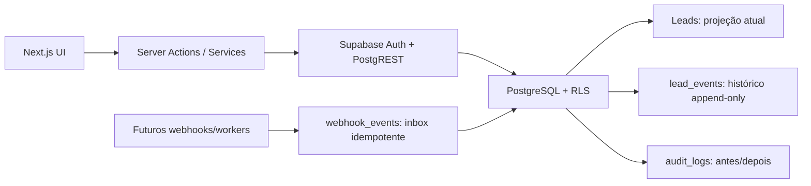

# Arquitetura

## Verticais por organização

O RevFlow permanece um único SaaS multi-tenant. `organizations.vertical` seleciona `agency` ou `real_estate`; o layout protegido recebe a vertical da organização ativa e aplica navegação, logo e variáveis CSS sem duplicar autenticação, banco ou componentes estruturais. A vertical imobiliária é documentada em `docs/real-estate.md`.

## Visão geral

O Orbit CRM usa Next.js App Router na Vercel e Supabase como fonte primária de dados, autenticação e autorização. Componentes de servidor leem dados diretamente com a sessão do usuário; componentes de cliente ficam restritos às interações que exigem estado local, como o Kanban. Toda mutação é validada no servidor e novamente protegida por constraints/RLS no PostgreSQL.

## Princípios

1. **Supabase é a fonte de verdade.** Não há estado comercial durável no browser.
2. **Eventos e projeção convivem.** `leads.stage_id` permite leitura rápida; `lead_events` explica como o lead chegou ali. Não é event sourcing completo.
3. **Multi-tenancy no banco.** Recursos do domínio carregam `organization_id`, constraints impedem referências cruzadas e RLS isola cada organização.
4. **Mutações críticas são atômicas.** `move_lead_stage` autoriza, bloqueia o registro, atualiza a projeção e cria o evento em uma transação.
5. **Server-first.** Consultas e validação ficam em `services/` e Server Actions. React não contém regra de negócio.
6. **Integrações entram por adaptadores.** SDKs de OpenAI/WhatsApp/Calendly não devem aparecer em componentes ou tabelas centrais.

## Fluxo de autenticação e tenant

O Supabase Auth emite a sessão. `proxy.ts` renova cookies e protege rotas. O onboarding chama `create_organization_with_defaults`, que em uma transação cria organização, vínculo de owner, pipeline, etapas e catálogo inicial. A organização ativa da fase 1 é o primeiro membership do usuário. Uma fase posterior pode adicionar seletor persistido em cookie, sempre validado contra `organization_members`.

## Camadas

- `app/`: rotas, layouts, Server Actions e composição de páginas.
- `components/`: UI; apenas o shell e Kanban exigem cliente.
- `services/`: consultas e casos de uso do domínio.
- `lib/supabase/`: clientes browser/server e renovação da sessão.
- `services/ai/`: contrato, schema e futura implementação do provedor.
- `services/webhooks/`: contratos de verificação por provedor.
- `types/`: tipos do banco e modelos de leitura da UI.
- `supabase/migrations/`: schema, constraints, funções, índices e RLS versionados.
- `docs/`: decisões e contratos operacionais.

## Performance

- O dashboard usa uma agregação SQL (`get_dashboard_metrics`) em vez de transferir todos os leads.
- A lista de leads pagina em blocos de 50 e busca por índice/consulta do banco.
- O Kanban carrega até 500 cards do pipeline principal no MVP. Antes de volume superior, implementar paginação por coluna ou janela virtual sem subscriptions globais.
- Serviços carregam relacionamentos em lotes, evitando N+1.
- Índices cobrem board, owner, criação, timelines, agenda, auditoria e fila de webhooks.

## Segurança

- Nunca expor `SUPABASE_SERVICE_ROLE_KEY` em variável `NEXT_PUBLIC_*`.
- Server Actions validam entradas com Zod; RLS e constraints continuam sendo a barreira final.
- Funções `security definer` têm `search_path` fixo, autorização explícita e grants mínimos.
- `lead_events` e `audit_logs` não têm policies de update/delete para usuários.
- Webhooks só devem existir após implementação da assinatura oficial do provedor sobre o corpo bruto, limite de payload, rate limit e inbox idempotente.
- Textos do usuário são renderizados pelo escape padrão do React; não usar `dangerouslySetInnerHTML`.

## Fases seguintes

1. Edição do lead, filtros avançados, responsável, tags e pipeline configurável.
2. Clientes, projetos e tarefas a partir de `deal_won`; reuniões/calendário.
3. Tracking consentido e webhooks de forms/Calendly/WhatsApp com workers e retries.
4. Qualificação OpenAI com structured outputs, aprovação humana e versionamento de prompt/modelo.
5. Meta/Google Ads, atribuição e relatórios; seleção de organização e billing para SaaS.
6. Paginação/virtualização por coluna, busca full-text e observabilidade para alto volume.
## Limites críticos de autorização

Fluxos que mudam permissões da equipe e criam mensagens de WhatsApp não dependem apenas de Server Actions. Eles são impostos por funções PostgreSQL `security definer` com `search_path` fixo, autorização baseada em `auth.uid()` e grants mínimos. A action apenas valida o formulário, chama a fronteira transacional e revalida a interface.
