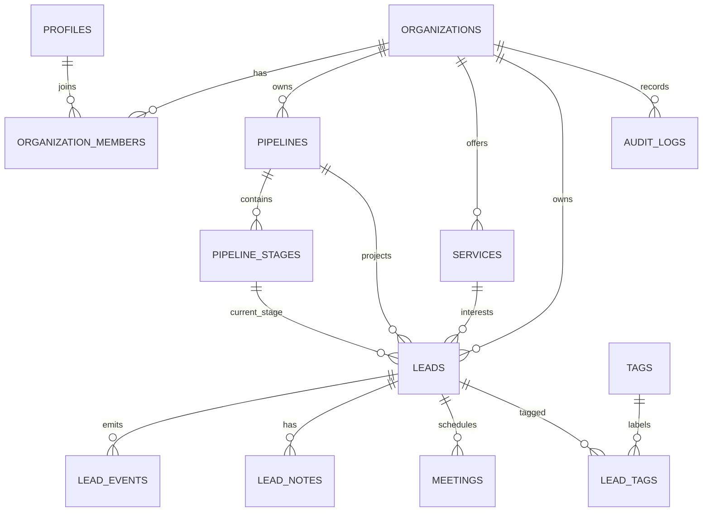

# Banco de dados

## Schema implementado

| Tabela                          | Responsabilidade                                   |
| ------------------------------- | -------------------------------------------------- |
| `profiles`                      | Perfil público mínimo vinculado a `auth.users`.    |
| `organizations`                 | Tenant e configurações isoladas.                   |
| `organization_members`          | Usuário, organização e papel (`owner` a `viewer`). |
| `pipelines` / `pipeline_stages` | Definição ordenada do funil.                       |
| `services`                      | Catálogo de serviços da organização.               |
| `leads`                         | Projeção atual e campos comerciais pesquisáveis.   |
| `lead_events`                   | Histórico append-only dos eventos de negócio.      |
| `lead_notes`                    | Notas colaborativas; inserção também gera evento.  |
| `tags` / `lead_tags`            | Catálogo e relação N:N com leads.                  |
| `meetings`                      | Agenda interna e IDs externos futuros.             |
| `webhook_events`                | Inbox idempotente para integrações futuras.        |
| `audit_logs`                    | Valores antes/depois de alterações do lead.        |
| `organization_invitations`      | Convites com token armazenado somente como hash.   |
| `tasks`                         | Follow-ups, lembretes e execução comercial.        |
| `clients` / `proposals`         | Receita, itens e relacionamento com o cliente.     |
| `projects`                      | Entrega e pós-venda.                               |
| `ai_analyses`                   | Qualificação versionada e revisável.               |
| `integration_connections`       | Estado e referência server-only das integrações.   |
| `conversations` / `messages`    | Histórico normalizado do WhatsApp.                 |

## Relacionamentos

As chaves estrangeiras compostas incluem `organization_id` onde necessário. Isso impede que um lead de uma organização aponte para etapa, pipeline ou serviço de outra, mesmo se houver bug na aplicação.

## Campos extensíveis

`leads.custom_fields` guarda apenas atributos pouco frequentes/específicos do tenant. Campos usados em filtro, ordenação, join ou métricas permanecem colunas tipadas. `metadata` em eventos guarda contexto específico do evento, não substitui dados centrais.

## RLS

- Leitura exige membership na organização.
- Escrita exige papel diferente de `viewer`.
- Exclusão de leads é restrita a owner/admin.
- Eventos são insert/select; não são editáveis ou removíveis por usuários.
- Auditoria é select-only para membros e escrita somente por trigger confiável.
- `webhook_events` não possui policy para usuários autenticados; será acessado por worker server-only.

Helpers privados `is_org_member`, `can_write_org` e `is_org_admin` evitam duplicação e recursão de policies.

## Funções transacionais

- `create_organization_with_defaults(name, slug)`: cria tenant e dados iniciais.
- `move_lead_stage(lead_id, stage_id)`: valida tenant/pipeline, atualiza lead e cria `stage_changed`.
- `get_dashboard_metrics(organization_id)`: retorna agregados reais do tenant.
- `schedule_meeting(...)`: valida tenant, serializa conflitos e cria evento.
- `update_lead_details(...)`: atualiza projeção, tags e evento na transação.
- `book_public_meeting(...)`: reserva pública idempotente com throttling.
- `convert_won_lead(...)`: cria cliente/projeto uma única vez por lead ganho.

## Migrations

`202608130001_initial_crm.sql` cria a fundação. A migration incremental
`202608140001_phase_2_operations.sql` adiciona a camada operacional. Nunca edite
uma migration aplicada; gere outra com timestamp posterior.
